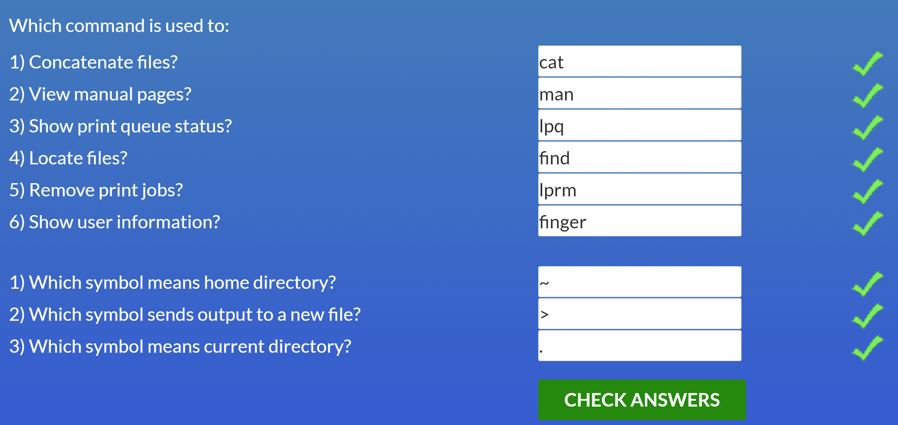
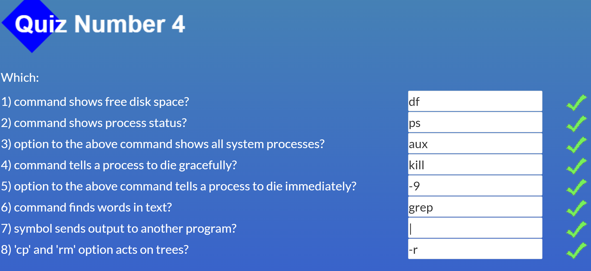
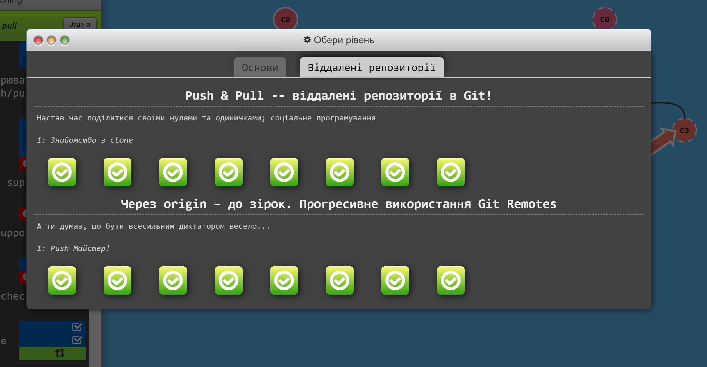
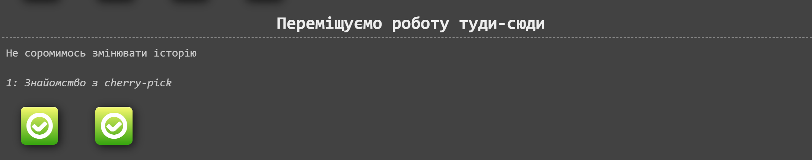

# kottans-frontend

## Git Basics

I would like to share my impressions of the learned Git Basics material. Initially, when I started watching the first video, I was frustrated because I couldn’t understand anything, I expected to hear how to write code, and they began to explain what Git is. Since I am new to this field, it was difficult for me to get up to speed. It took me a long time to look through the courses, complete the assignments, and eventually master this topic. I really liked the courses: accessible, understandable, convenient. Now I understand what GIt and GitHub are, and I understand that writing good and clean code is great, but you also need to be able to work with this code together with the team.

## Linux CLI, and HTTP

I really enjoyed the Linux Survival course, especially the first two modules. It was interesting, I liked solving mini puzzles. I am sure I will use many commands in the future when working with the console (for example: cd, mkdir, ls, "\*" "~", etc.) Most of the commands were new to me, only those that I studied during my acquaintance were familiar with Git Basics. Levels 3 and 4 were already more difficult to understand, but interesting, especially how to print text using Linux and a printer)
Bottom line: a great course to understand how Linux works and learn useful commands to make it even easier to work.
After reading about HTTP, I learned a little bit about how the Internet works.

## Git Collaboration

After passing these levels, I was left with a double impression. At first it was more or less easy, but then the difficulties began. Spent a lot of time and effort to go through them to the end. I hope this will be useful to me.

